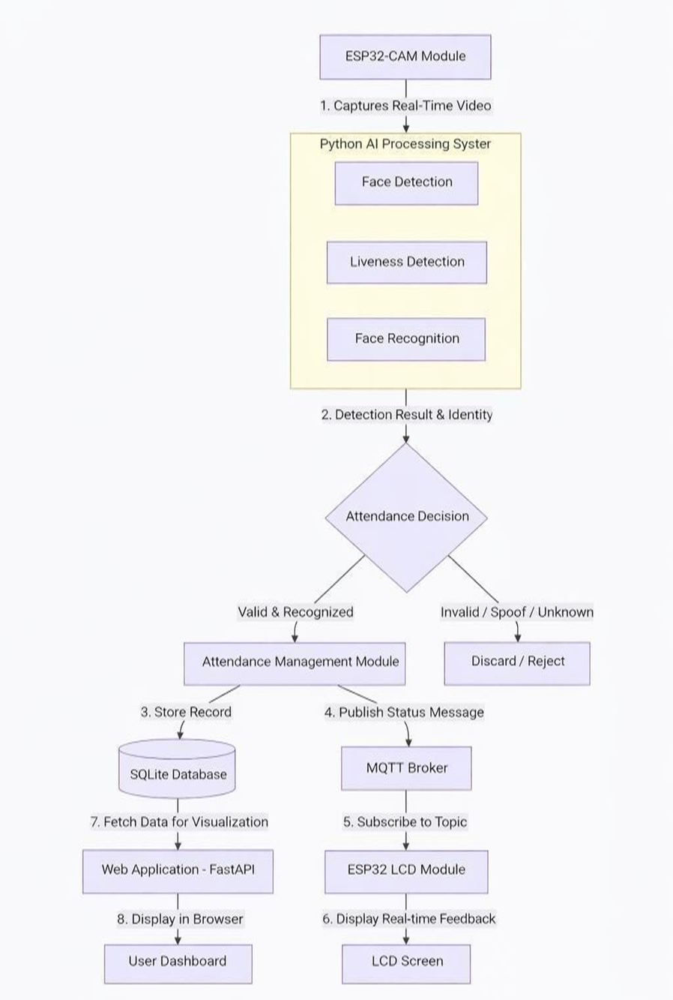
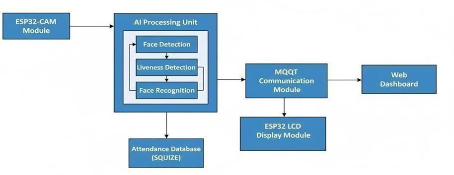
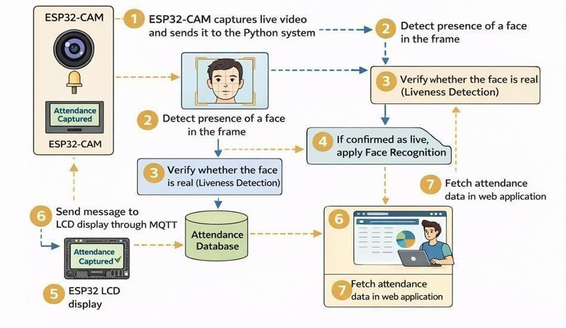
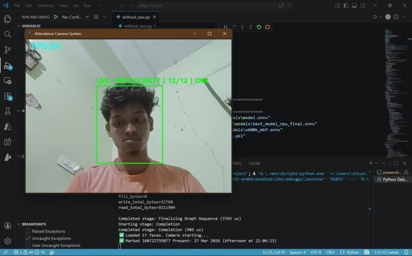
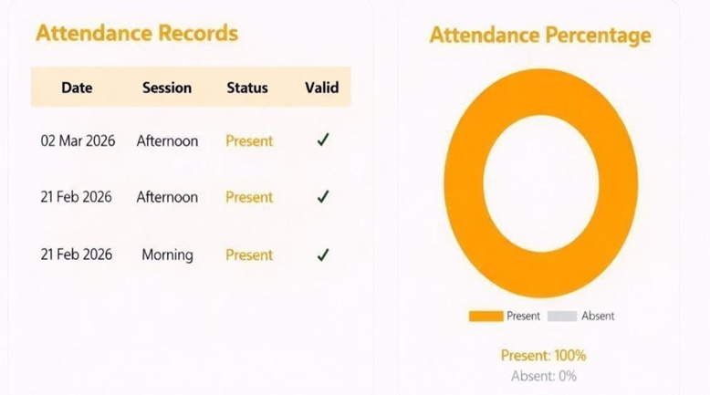
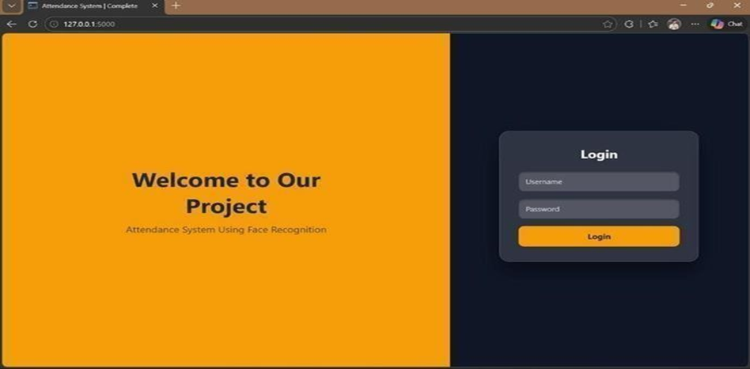

## 📖 Introduction

Attendance management is an important process in educational institutions and organizations to monitor the presence of individuals. Traditional methods such as manual registers, RFID cards, and biometric systems have several drawbacks like time consumption, human errors, and chances of proxy attendance.

To solve these problems, this project presents a **Smart Attendance System using Facial Recognition**. The system uses an ESP32-CAM module to capture real-time video and a Python-based Artificial Intelligence model to detect and recognize faces.

In addition, the system includes **liveness detection**, which ensures that the detected face belongs to a real person and not a photo or video. This improves the security of the system and prevents fake attendance.

Once a person is recognized, the attendance is automatically recorded in a database along with date and time. The system also provides real-time feedback through an LCD display and allows users to view attendance records using a web-based dashboard.

By combining Artificial Intelligence, IoT, and Web technologies, the system provides a **contactless, accurate, and efficient attendance solution**, suitable for real-world applications like classrooms, offices, and organizations.

--

## 📁 Project Structure

The project is organized in a structured way to separate code, hardware, models, and documentation for better understanding and maintenance.

```id="k2x9p1"
Smart_Attendance_System_Using_Facial_Recognition/
│
├── README.md                      # Project documentation
├── requirements.txt              # Python dependencies
│
├── main/                         # Main Python system
│   ├── main.py
│   ├── data.py
│   ├── utils.py
│
├── models/                       # AI Models
│   ├── best.pt
│   ├── face_detection.onnx
│   ├── face_recognition.onnx
│
├── database/                     # Attendance Database
│   └── attendance.db
│
├── esp32_code/                   # ESP32-CAM Code
│   └── esp32_cam.ino
|   └── esp332_Lcd.ino
│
├── web_app/                      # Web Dashboard
│   ├── app.py
│   ├── templates/
│   ├── static/
│
├── images/                       # Project Images (from PDF)
│   ├── architecture.png
│   ├── block_diagram.png
│   ├── workflow.png
│   ├── dashboard.png
│   ├── final_output.png


### 📌 Explanation:

* `main/` → Python AI system (face detection + recognition)
* `models/` → YOLO / ONNX models
* `database/` → attendance storage
* `esp32_code/` → hardware code
* `web_app/` → dashboard (FastAPI)
* `images/` → diagrams from project report
* `report/` → final PDF
* `output/` → results & screenshots

This structure makes the project easy to understand, run, and present professionally on GitHub.
```

## 🎯 Objective

The main objective of this project are:

* To develop an automated attendance system using facial recognition
* To eliminate proxy attendance using liveness detection
* To capture real-time video using ESP32-CAM
* To store attendance data in a database
* To provide real-time feedback using LCD display
* To develop a web dashboard for monitoring attendance
* To create a secure and contactless system

## ⬇️ Method 1: Clone the Repository

Follow these steps to download the project to your system using Git:

1. Open Command Prompt / Terminal
2. Run the following command:
```
git clone https://github.com/Shiva-Sharan/Smart_Attendance_System_Using_Facial_Recognition_with_ESP32-CAM.git
```
3. Move into the project folder:

cd Smart_Attendance_System_Using_Facial_Recognition_with_ESP32-CAM

Now the project is successfully downloaded to your system.

## ⬇️ Method 2: Download as ZIP

1. Open the GitHub repository
2. Click on the **Code** button
3. Select **Download ZIP**
4. Extract the ZIP file on your system

Now you can open the project folder and start working.

## ▶️ Run the Project

1. Install Python (if not installed)

2. Install required libraries:

pip install -r requirements.txt

3. Run the main file:

python main.py

4. Make sure:

* ESP32-CAM is connected to WiFi
* Correct IP address is used in the code

---

### 🔹 Step 1: Create Database

Run:

python db_creation.py

✔ This will create:

* attendance.db
* students table
* attendance table

---

### 🔹 Step 2: Prepare Dataset

✔ Create a folder:
Faces/

✔ Inside it:
Faces/
├── 160722735077/
│    ├── img1.jpg
│    ├── img2.jpg
├── 160722735086/
│    ├── img1.jpg

✔ Each folder name = student ID

---

### 🔹 Step 3: Build Face Database

Run:

python build_face_db_esp32_raw.py

✔ This will:

* Detect faces from images
* Apply alignment & quality check
* Generate embeddings
* Save as face_db.pkl

---

### 🔹 Step 4: Setup ESP32

✔ Upload:

* cam_code.ino → ESP32-CAM
* Lcd_code.ino → ESP32 LCD

✔ Connect WiFi and note IP address

✔ Update in code:
ESP32_CAM_URL = "http://<your-ip>:8080/video"

---

### 🔹 Step 5: Run Main System

Run:

python main.py

✔ This will:

* Capture video from ESP32
* Detect face
* Check liveness
* Recognize person
* Mark attendance
* Send message to LCD (MQTT)

---

### 🔹 Step 6: Run Web Dashboard

Run:

python app.py

✔ Open browser:
http://localhost:5000

✔ Login using:

* ID = student ID
* Password = same ID

✔ View attendance dashboard

---

## 🔁 System Flow

1. ESP32 → sends video
2. Python → detects face
3. Liveness → check real person
4. Recognition → identify person
5. Database → store attendance
6. MQTT → send to LCD
7. Web App → display data

---

## ✅ Final Output

* Attendance automatically marked
* LCD shows result
* Web dashboard shows records

## 🧩 Components Used

### 🔹 Hardware

* ESP32-CAM
* ESP32 (for LCD)
* 16x2 LCD Display
* Power Supply

### 🔹 Software

* Python
* OpenCV
* ONNX Runtime
* FastAPI / Flask
* SQLite Database
* MQTT Protocol

## 📸 Project Outputs

### System Architecture



### Block Diagram



### Workflow



### LCD Output



### Dashboard



### Login Page



## 🏁 Conclusion

This project successfully demonstrates the implementation of a **Smart Attendance System using Facial Recognition with ESP32-CAM**. By integrating Artificial Intelligence, IoT, and Web technologies, the system provides an efficient, secure, and contactless solution for attendance management.

The use of **liveness detection** ensures that only real individuals are marked present, eliminating proxy attendance. The system also offers real-time feedback through an LCD display and a web-based dashboard for easy monitoring.

Overall, this project highlights the practical application of modern technologies in solving real-world problems and improving accuracy, efficiency, and security in attendance systems.

---

## 📜 Declaration

I hereby declare that this project titled **"Smart Attendance System using Facial Recognition with ESP32-CAM"** is an original work carried out by me as part of my academic project. All the sources of information and references used have been duly acknowledged.


---

## 📌 Note

For complete implementation details, source code, and documentation, please refer to this GitHub repository.

