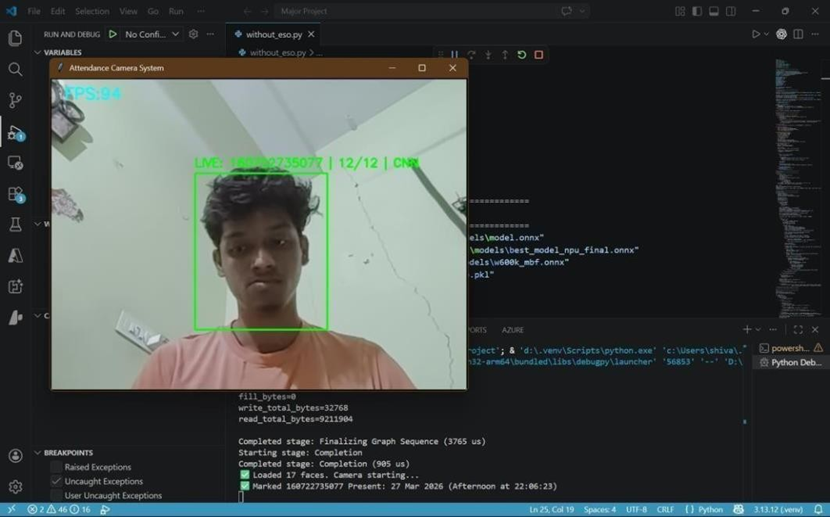
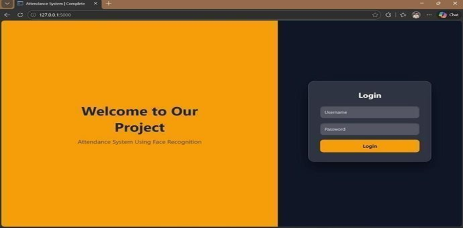

# 👁️ Smart Attendance System with AI Facial Recognition & ESP32-CAM

[](https://www.python.org/)
[](https://opencv.org/)
[](https://www.espressif.com/)
[](https://onnx.ai/)
[](https://mqtt.org/)

> **A production-grade Internet of Things (IoT) and Computer Vision solution featuring real-time facial recognition, anti-spoofing liveness detection, and automated database logging, integrated with an ESP32-CAM surveillance module.**

### 🎥 [Watch the Project Demo Video](https://drive.google.com/file/d/1XTi2sku-xXh-D-Gfc53ZzSrhLwu0CHmJ/view?usp=sharing)

---

## 📋 Table of Contents

- [Project Overview](#-project-overview)
- [Problem Statement](#-problem-statement)
- [System Architecture](#-system-architecture)
- [Core Features](#-core-features)
- [Technology Stack](#-technology-stack)
- [Hardware Components](#-hardware-components)
- [Execution Flow](#-execution-flow)
- [Repository Structure](#-repository-structure)
- [Installation & Setup](#-installation--setup)
- [Dashboard & Outputs](#-dashboard--outputs)
- [Challenges Solved](#-challenges-solved)
- [Future Enhancements](#-future-enhancements)

---

## 🎯 Project Overview

This repository implements an **Enterprise-Scale Smart Surveillance & Access Control System**. Using an ESP32-CAM as a remote wireless IP camera, the system streams high-performance video to a Python-based Artificial Intelligence inference server. 

The AI engine rapidly detects faces, applies advanced Anti-Spoofing (Liveness) models to block static photos or videos, and matches identities against an optimized embedding database. Successful recognitions are securely logged into a SQLite database, broadcasted to a physical LCD via MQTT, and visualized on an intuitive web dashboard.

---

## 💼 Problem Statement

Traditional attendance and access control systems (e.g., RFID, manual registers, biometric fingerprint scanners) suffer from critical vulnerabilities:
- **Proxy Attendance**: Easily bypassed using shared ID cards.
- **Hygiene & Wear**: Contact-based fingerprint systems degrade and pose health risks.
- **Lack of Verification**: Simple facial recognition can be spoofed by presenting a high-resolution photograph.

**The Solution:** Build a robust, contactless, and spoof-resistant AI vision pipeline distributed between edge hardware (ESP32) and a centralized inference engine, ensuring maximum security and zero-friction tracking.

---

## 🏛️ System Architecture

The architecture relies on a highly decoupled IoT pattern:


1. **Edge Vision**: `ESP32-CAM` captures and streams video over HTTP.
2. **AI Inference Layer**: Python server retrieves the stream, runs Face Detection, Liveness Validation, and Identity Matching via ONNX Runtime.
3. **Data Layer**: Attendance events are committed to a fast, localized SQLite Database.
4. **Hardware Feedback**: Successful logs trigger an MQTT payload delivered to a secondary ESP32 connected to an LCD display.
5. **Analytics Dashboard**: A FastAPI/Flask application queries the database to serve real-time dashboard analytics to administrators.

---

## ✨ Core Features

| Feature | Description |
|---|---|
| **Facial Recognition** | High-accuracy ONNX models for rapid identity embedding and matching. |
| **Anti-Spoof Liveness** | Deep learning validation to block 2D image/video proxy attempts. |
| **Edge IoT Integration** | Completely wireless IP camera streaming via ESP32-CAM. |
| **MQTT Communication** | Asynchronous hardware feedback to remote LCD displays. |
| **Automated DB Logging** | Real-time attendance state transitions stored in SQLite. |
| **Interactive Dashboard** | Web-based UI to monitor employee/student attendance metrics. |

---

## 🛠️ Technology Stack

| Layer | Technologies |
|---|---|
| **AI / Machine Learning** | Python, OpenCV, ONNX Runtime, NumPy |
| **Embedded / IoT** | C++, Arduino Core, MQTT (PubSubClient) |
| **Backend & Web** | FastAPI / Flask, HTML/CSS/JS |
| **Database** | SQLite3 |

---

## 📡 Hardware Components

- **ESP32-CAM Module**: Primary wireless vision sensor (OV2640).
- **ESP32 Development Board**: Secondary node for MQTT subscription and display.
- **16x2 I2C LCD Display**: Provides real-time physical confirmation.
- **FTDI Programmer**: For flashing embedded C++ code.
- **5V Power Supply**: Stable voltage source for uninterrupted streaming.

---

## 🔄 Execution Flow

1. **Initialization**: The AI server spins up, pre-loading the ONNX models into memory to reduce inference latency.
2. **Stream Acquisition**: A persistent HTTP connection pulls JPEG chunks from the ESP32-CAM.
3. **Pipeline Processing**: 
   - `Face Detection` extracts the bounding box.
   - `Liveness Detection` evaluates the crop for 3D depth/texture anomalies.
   - `Recognition` generates a 512-d embedding and calculates cosine similarity against the `face_db.pkl`.
4. **Commit & Broadcast**: Upon exceeding the confidence threshold, the user is marked 'Present' in SQLite, and an MQTT message (`"Welcome [Name]"`) is published to the LCD topic.

---

## 📁 Repository Structure

```text
Smart_Attendance_System/
│
├── src/                          # Core AI and processing logic
│   └── attendance_system.py      # Main inference and pipeline runner
│
├── hardware/                     # Embedded C++ Code
│   ├── cam_code.ino              # ESP32-CAM streaming server
│   ├── Lcd_code.ino              # ESP32 MQTT subscriber and LCD driver
│   └── hotspot.ino               # Alternative AP setup
│
├── dashboard/                    # Web Application UI
│   ├── app.py                    # Web server routing
│   ├── static/                   # CSS/JS assets
│   └── templates/                # HTML Jinja templates
│
├── scripts/                      # DB and Model Utilities
│   ├── db_creation.py            # SQLite schema initialization
│   └── build_face_db_esp32_raw.py# Face embedding enrollment script
│
├── models/                       # Pre-trained ONNX Models
├── assets/                       # Images and Architecture diagrams
├── requirements.txt              # Python dependencies
└── README.md                     # Project documentation
```

---

## 🚀 Installation & Setup

### 1. Hardware Flashing
Flash `hardware/cam_code.ino` to your ESP32-CAM using an FTDI adapter. Update your WiFi credentials within the sketch. Note the assigned IP address from the Serial Monitor.

### 2. Software Requirements
Ensure Python 3.10+ is installed, then install dependencies:
```bash
pip install -r requirements.txt
```

### 3. Database & Enrollment
Initialize the database and build your authorized face embeddings:
```bash
# Generate attendance.db
python scripts/db_creation.py

# Place employee photos inside a 'Faces/' directory and build embeddings
python scripts/build_face_db_esp32_raw.py
```

### 4. Execute the System
Update the `ESP32_CAM_URL` in `src/attendance_system.py` with your device's IP, then launch:
```bash
python src/attendance_system.py
```

### 5. Launch Dashboard
In a separate terminal, launch the reporting dashboard:
```bash
python dashboard/app.py
```
Navigate to `http://localhost:5000` to view logs.

---

## 📊 System Outputs & Dashboards

The system provides multiple interfaces for real-time monitoring and historical attendance tracking.

### Real-Time Inference Window
*(System displaying bounding boxes, liveness validation, and names)*


### Web Dashboard
*(Analytics view showing attendance logs)*


### Login Interface
*(Secure authentication for dashboard access)*


---

## 🛡️ Challenges Solved

- **Network Latency & Jitter**: Implemented multi-threaded, queue-based frame grabbing to decouple the camera's HTTP latency from the heavy ONNX inference loop, ensuring smooth processing.
- **Lighting Variability**: Engineered dynamic auto-exposure handling and CLAHE histogram equalization to maintain recognition accuracy in poor lighting conditions.
- **Inference Bottlenecks**: Applied strict frame skipping algorithms and motion-based cache-reuse to drastically reduce CPU load while maintaining tracking stability.

---

## 🔮 Future Enhancements

- [ ] Transition from SQLite to PostgreSQL for multi-node scalability.
- [ ] Implement Apache Kafka instead of MQTT for robust event-streaming and historical playback.
- [ ] Containerize the Python AI Server using Docker for one-command deployment.
- [ ] Add an Alerting module (Twilio/SMTP) for unrecognized, recurring faces (Intrusion Detection).

---

<div align="center">

**Built with Computer Vision · Designed for the Edge · Open for Contributions**

</div>
